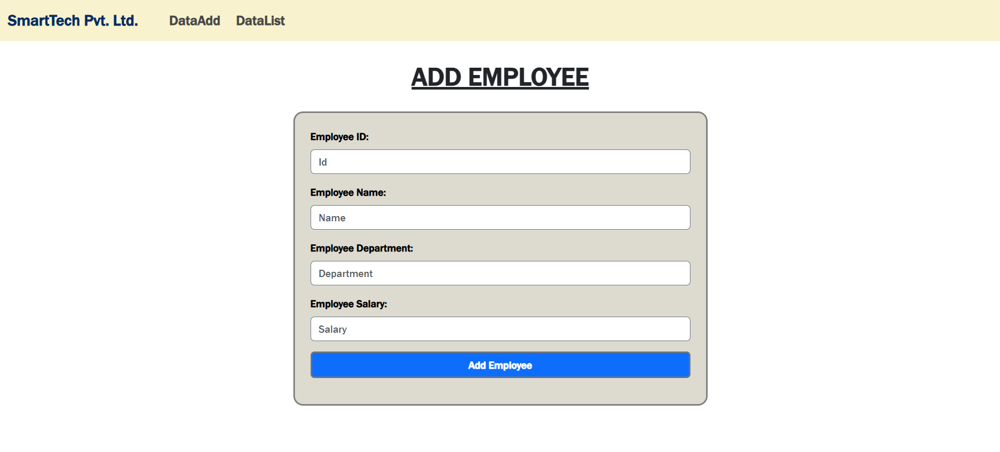
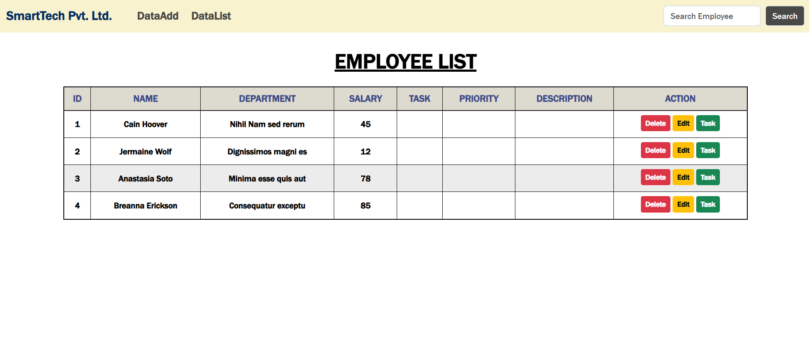
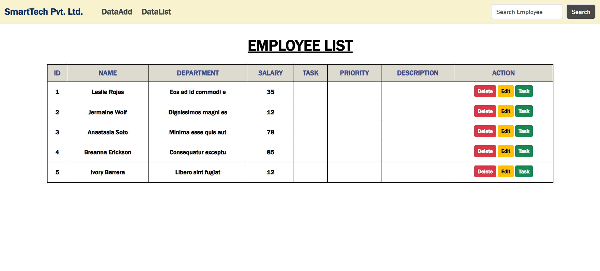
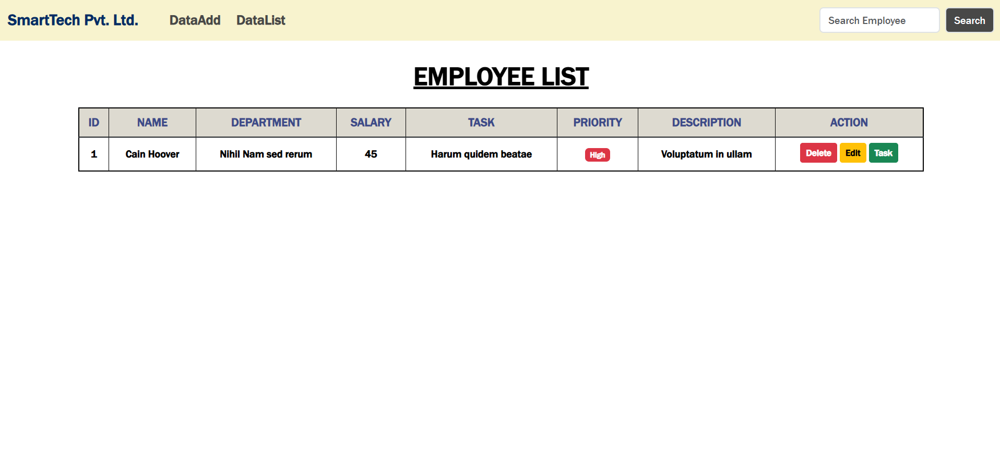
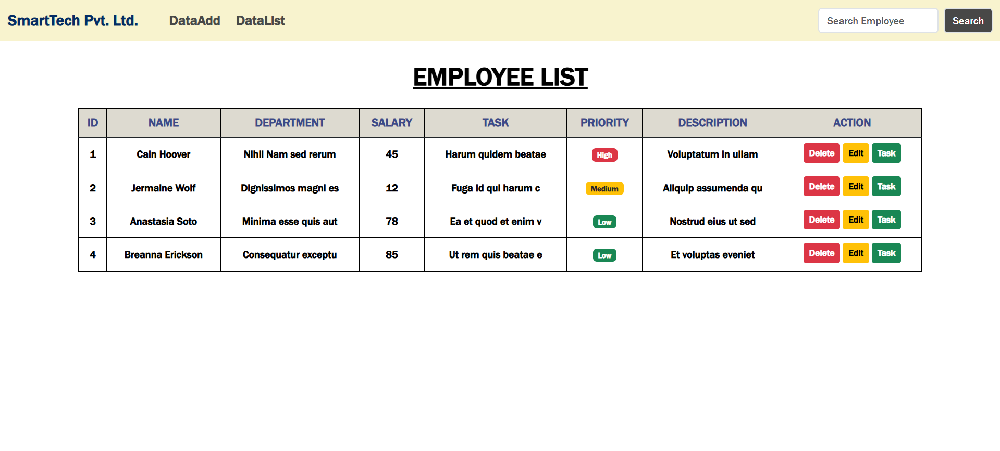

# Node.js_EMP Task Manager

Node.js_EMP is a simple and efficient task management application built with Node.js and Express. It allows users to add, edit, delete, list, and search tasks through a clean web interface. The project uses EJS templates for rendering views and provides a user-friendly experience for managing daily tasks.

## Features

- **Add Tasks:** Easily add new tasks with a simple form.
- **Edit Tasks:** Update existing tasks to keep your list up to date.
- **Delete Tasks:** Remove tasks that are no longer needed.
- **List Tasks:** View all your tasks in a structured table.
- **Search Tasks:** Quickly find tasks using the search functionality.

## Folder Structure

- `index.js` - Main server file.
- `views/` - Contains EJS templates for different pages (add, edit, list, etc.).
- `output/` - Stores image assets used in the application.

## Getting Started

1. **Install dependencies:**
   ```bash
   npm install
   ```
2. **Run the application:**
   ```bash
   node index.js
   ```
3. **Open your browser:**
   Navigate to `http://localhost:3000` to use the app.
   Deploy Link: https://node-js-emp-system-pr.onrender.com/

## Screenshots


Below are the icons used in the application UI:

| Add      | Edit     | Delete   | List     | Search   | Task     |
|----------|----------|----------|----------|----------|----------|
|  |  |  |  |  |  |

The `output/` folder contains these icons for Add, Edit, Delete, List, Search, and Task actions used in the UI.

## Technologies Used

- Node.js
- Express.js
- EJS (Embedded JavaScript Templates)

## License

This project is licensed under the MIT License.
